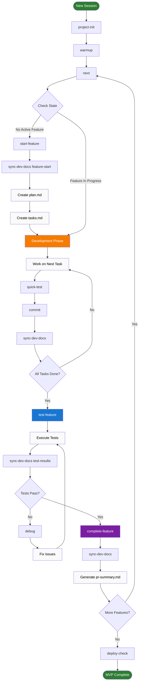

# Memory Album Project Context

## Project Overview
This is a multi-tenant wedding memory collection platform where guests share memories and photos that are automatically organized using AI.

## Key Decisions Made

### Architecture
- **Single Vercel deployment** (Next.js full stack)
- **Supabase** for database and storage
- **Qdrant** for vector storage (collect embeddings in Phase 1, use in Phase 2)
- **Google Gemini** for AI (cheapest option at <$3 per wedding)

### Development Phases
1. **Phase 1 - MVP**: Your wedding, basic features, store embeddings
2. **Phase 2 - RAG**: Enable vector search features
3. **Phase 3 - Multi-tenant**: Productize for other weddings
4. **Phase 4 - Scale**: Advanced features

### Tech Stack Rationale
- **Why Gemini**: 10x cheaper than Claude, free embeddings
- **Why Vercel-only**: Simpler deployment, everything in one place
- **Why store embeddings now**: Free at this scale, enables future features without migration

### Cost Analysis
- Your wedding: <$3 total
- 10 weddings/month: ~$75/month
- 100 weddings/month: ~$300/month

### Documents Created
All documentation is in `/docs` directory:
- `architecture.md` - System design
- `api-design.md` - API endpoints
- `database-schema.md` - PostgreSQL schema
- `deployment-strategy.md` - Deployment guide
- `rag-features.md` - Future RAG features
- `ai-cost-comparison.md` - Detailed AI pricing analysis

## Next Steps
1. Initialize Next.js project
2. Set up Supabase
3. Create basic UI for memory submission
4. Implement Gemini categorization
5. Set up Qdrant for embedding storage
6. Build memory album view
7. Add Google Drive backup

## Important Context from Previous Discussion

### Multi-Tenant Strategy
- Each wedding gets a unique slug: `memories.love/{wedding-slug}`
- All data partitioned by `wedding_id`
- Separate Qdrant namespaces per wedding

### MVP Features for Your Wedding
- Memory submission with photos
- AI categorization (not using vectors yet)
- Basic album view
- Google Drive backup
- Store embeddings for future use

### Why We're Storing Embeddings Without Using Them
- Essentially free at wedding scale
- No migration needed later
- Can enable RAG features instantly in Phase 2
- Good learning opportunity

### Key Technical Decisions
- Use Next.js API routes (not separate backend)
- Use Gemini function calling for categorization (not vector search)
- Store up to 5 photos per memory submission
- Generate summaries asynchronously
- Use Vercel Cron for background jobs

## Development Commands
```bash
# When ready to start development
cd /Users/georgesu/projects/memory_album
npx create-next-app@latest . --typescript --tailwind --app
npm install @supabase/supabase-js
npm install qdrant-js
npm install @google/generative-ai
```

## Environment Variables Needed
```
NEXT_PUBLIC_SUPABASE_URL=
NEXT_PUBLIC_SUPABASE_ANON_KEY=
SUPABASE_SERVICE_KEY=
QDRANT_URL=
QDRANT_API_KEY=
GEMINI_API_KEY=
GOOGLE_DRIVE_CREDENTIALS=
JWT_SECRET=
```

## Questions Resolved
- ✅ RAG needed? No for MVP, but store embeddings anyway
- ✅ Separate backend? No, use Next.js API routes
- ✅ Which AI model? Gemini (cheapest with free embeddings)
- ✅ Vector DB worth it? Yes, free tier covers thousands of weddings

---

## Development Workflow

### Sprint-Based Development
We follow a sprint-based approach with the master plan in `/development-docs/development-plan.md`. Each sprint contains epics, which contain tasks.

### Workflow Visualization



**Legend:**
- 🟢 **Green (Start/End)**: Session boundaries
- 🟠 **Orange (Development)**: Active coding phase
- 🔵 **Blue (Testing)**: Quality assurance phase
- 🟣 **Purple (Completion)**: Feature finalization
- ⬜ **White**: Regular workflow steps
- 🔶 **Diamond**: Decision points

### Complete Workflow Sequence

#### 1. Session Start
**When:** Beginning a new Claude session or returning after a break
```
/project-init → /warmup → /next
```
- `/project-init`: Load full project context (if new session)
- `/warmup`: Quick refresh of current state (if returning)
- `/next`: Automatically determine next action

#### 2. Feature Development Cycle
**When:** Working through sprints and epics

```
/start-feature [name] → development → /quick-test → /test-feature [name] → /complete-feature [name]
```

**Detailed Flow:**

a. **Feature Start** (`/start-feature [feature-name]`)
   - Triggers when: No active feature or starting new epic
   - Creates folder in `/development-docs/[feature-name]/`
   - Runs `/sync-dev-docs feature-start` to:
     - Extract tasks from development-plan.md
     - Create tasks.md and plan.md
     - Cross out tasks in development-plan.md
   - **Auto-updates state**: Sets current_feature, phase="planning"
   - Sets up TodoWrite tracking
   - Next: Begin coding tasks

b. **Active Development**
   - Work through tasks.md checklist
   - Use `/sync-dev-docs` after every 2-3 completed tasks
     - **Auto-updates state**: tasks_completed count
   - Run `/workflow-state validate` after every 5 tasks (safety check)
   - Use `/debug [context]` when issues arise
   - Use `/quick-test` for rapid validation
   - Request `/manual-help [service]` for external setup
   - Use `/commit-smart` frequently (every 2-3 tasks)
   - Run `/sync-dev-docs task-complete` to update progress
   - Next: Continue until all tasks checked

c. **Testing Phase** (`/test-feature [feature-name]`)
   - Triggers when: All development tasks complete
   - **Auto-updates state**: phase="testing"
   - Runs `/sync-dev-docs` to generate test-plan.md
   - Guides through manual testing
   - Documents results with `/sync-dev-docs test-results`
   - Run `/workflow-state validate` before completion
   - Next: Fix issues or complete feature

d. **Feature Completion** (`/complete-feature [feature-name]`)
   - Triggers when: Testing passed
   - Runs `/sync-dev-docs` to generate pr-summary.md
   - **Auto-updates state**: Clears current_feature, increments sprint
   - Updates development-plan.md with completion
   - Archives feature as done
   - Run `/workflow-state show` to confirm state
   - Next: `/next` to start new feature

#### 3. Progress Monitoring
**When:** Checking status or planning

```
/sprint-status → /next-task → /warmup
```
- `/sprint-status`: Overview of current sprint
- `/next-task`: Identify specific next action
- `/warmup`: Quick context refresh

#### 4. Git Workflow
**When:** Saving progress

```
/commit-smart → /commit-feature [name] "[message]"
```
- `/commit-smart`: Quick commits during development
- `/commit-feature`: Formal feature completion commits

#### 5. Deployment Preparation
**When:** Ready for production

```
/deploy-check → /complete-feature production-setup
```
- Final validation before launch
- Ensures all systems ready

### Decision Tree for /next Command

```
START
  ↓
[Check development-plan.md]
  ↓
Any in-progress features? 
  ├─ NO → Find next uncompleted epic → `/start-feature [name]` → `/sync-dev-docs feature-start`
  └─ YES ↓
     [Check feature folder]
       ↓
     Docs need sync? (>3 tasks since last sync)
       ├─ YES → `/sync-dev-docs`
       └─ NO ↓
          All tasks complete?
            ├─ NO → Continue development → Work on next task
            └─ YES ↓
               test-plan.md exists?
                 ├─ NO → `/test-feature [name]` → `/sync-dev-docs`
                 └─ YES ↓
                    Tests passed?
                      ├─ NO → Fix issues → `/sync-dev-docs test-results` → Re-test
                      └─ YES → `/complete-feature [name]` → `/sync-dev-docs`
```

### Automation Principles

The workflow minimizes manual intervention by:
1. **Auto-detection**: `/next` determines appropriate action
2. **State tracking**: System knows where you are in workflow
3. **Smart defaults**: Commands work without parameters when possible
4. **Context preservation**: Each command builds on previous state
5. **Graceful handoffs**: Clear transitions between phases

### When NOT to Use Commands

Some situations require manual work instead of commands:
- **External service setup**: Use browser/dashboard directly
- **Design decisions**: Discuss before implementing
- **Production credentials**: Never store in code
- **User testing**: Get real feedback on actual devices
- **Complex debugging**: Sometimes need deep investigation

### Workflow State Tracking

The system maintains state in `.workflow-state.json` to track:
- Current sprint and progress
- Active feature and phase
- Workflow position and next steps
- Environment setup status
- Command history

**State Management:**
- `/workflow-state` - Show current state
- `/workflow-state reset` - Rebuild from project analysis
- `/workflow-state recover` - Fix inconsistencies
- `/workflow-state validate` - Check for issues

### Recovery Procedures

**If workflow gets confused:**
1. Run `/workflow-state validate` to check for issues
2. Run `/workflow-state recover` if inconsistencies found
3. Run `/warmup` to check current state
4. Run `/sprint-status` to see progress
5. Check `/development-docs/` for active features
6. Use `/next` to auto-correct
7. Worst case: `/workflow-state reset` to rebuild

### Directory Structure
```
/development-docs/
├── development-plan.md          # Master checklist (auto-updated)
└── [feature-name]/
    ├── tasks.md                 # Feature tasks (synced from plan)
    ├── plan.md                  # Implementation details
    ├── test-plan.md            # Test scenarios
    ├── test-results.md         # Test outcomes
    └── pr-summary.md           # Change summary
```

### Documentation Sync Rules

1. **Task Movement**: When starting a feature, tasks move from `development-plan.md` to `[feature]/tasks.md` and get crossed out (~~task~~) in the master plan.

2. **Progress Tracking**: Task completion is tracked in both locations - checkboxes update in `tasks.md` and reflected in `development-plan.md`.

3. **Document Generation**: 
   - `plan.md` - Created at feature start with template
   - `test-plan.md` - Generated when development complete
   - `test-results.md` - Updated during testing
   - `pr-summary.md` - Generated at feature completion

4. **Never Touch `/docs/`**: High-level planning docs are only updated manually when architecture or strategy changes.

### Slash Commands

#### Feature Naming Convention
Features are identified by kebab-case names derived from epics in development-plan.md:
- `project-setup` → Sprint 0: Initial Setup
- `supabase-setup` → Sprint 1: Supabase Setup  
- `memory-submission` → Sprint 2: Memory Submission UI/API
- `ai-categorization` → Sprint 3: AI Categorization
- `memory-album` → Sprint 4: Memory Album Display
- `wedding-config` → Sprint 5: Wedding Configuration
- `background-jobs` → Sprint 6: Background Processing
- `production-ready` → Sprint 7: Polish & Production

The system maps feature names to epics by:
1. Searching development-plan.md for matching epic titles
2. Creating folders using the kebab-case name
3. Extracting all tasks under that epic
4. Maintaining bidirectional linking

#### `/start-feature [name]`
Initializes a new feature development folder with tasks and planning docs.
Example: `/start-feature memory-submission`

#### `/test-feature [name]` 
Creates test plan for the feature and prepares for testing.
Example: `/test-feature memory-submission`

#### `/complete-feature [name]`
Finalizes feature with PR summary and marks as complete.
Example: `/complete-feature memory-submission`

#### `/sprint-status`
Shows current sprint progress and remaining tasks.

#### `/next-task`
Identifies and starts the next task from development-plan.md.

#### `/commit-smart [message]`
Creates a git commit with optional message (auto-generates if not provided).

#### `/debug [context]`
Analyzes and troubleshoots issues with the provided context.

#### `/project-init`
Loads complete project context for new Claude sessions (Memory Album specific).

#### `/warmup`
Quick refresh of current project state and recent progress.

#### `/next`
Automatically determines and executes the next workflow action.

#### `/optimize-workflow`
Analyzes workflow and conservatively suggests improvements (if any).

#### `/sync-dev-docs [context]`
Synchronizes development documentation with current progress (auto-called by other commands).

#### `/workflow-state [action]`
Manage and inspect workflow state tracking (show/reset/recover/validate).

### Development Principles
- **Mobile-first**: Every feature must work perfectly on phones
- **Lightweight**: No over-engineering, minimal dependencies
- **Security**: Environment variables, input validation, rate limiting
- **Fast iteration**: Test frequently, deploy early
- **Clear communication**: Ask for help with manual steps

---

Note: This project was renamed from `wedding_site` to `memory_album` to better reflect its purpose as a platform for multiple weddings, not just a single site.